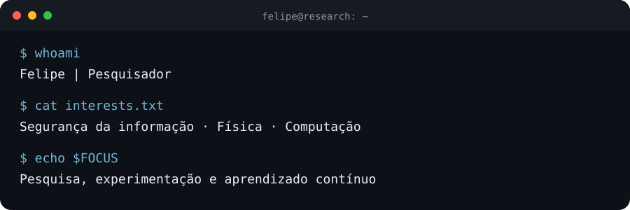

# Olá, eu sou Felipe 👋
**Pesquisador · Segurança da informação · Física**

### Sobre mim

Sou pesquisador, curioso por natureza e interessado em entender como sistemas e fenômenos funcionam. Meu foco profissional neste momento é a **pesquisa**, conectando aprendizado, investigação e desenvolvimento de projetos.

### Tecnologias

### Interesses de pesquisa

🔐 **Segurança da informação** — compreender sistemas, riscos e formas de proteção.

⚛️ **Física** — explorar fenômenos, perguntas e conexões com a computação.

🧪 **Computação aplicada** — transformar ideias em experimentos e aplicações com Python e Node.js.

### Projetos selecionados

| Projeto | Visão geral |
| :--- | :--- |
| **vult-web** | Aplicação web para explorar e desenvolver soluções digitais. |
| **sistema-gestao-clientes** | Aplicação desktop em Python para apoiar a organização de clientes e a gestão de associações. |

*Os repositórios desses projetos são privados; compartilho aqui apenas uma descrição geral.*

### Vamos nos conectar

Interesse em trocar ideias sobre pesquisa, segurança da informação, física e desenvolvimento.

<em>Investigar, experimentar e aprender continuamente.</em>

